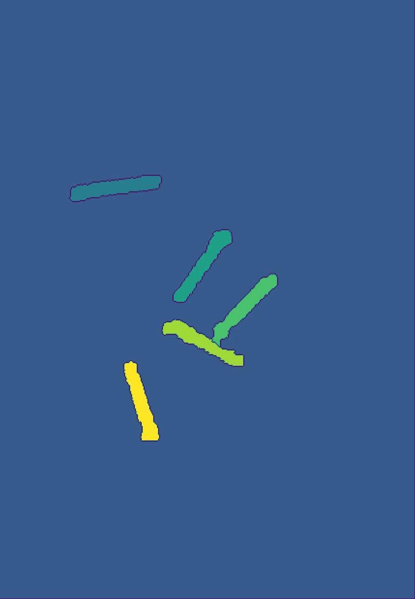

# Generic Object Detection and Count
##### Auto detection and count of object from photos without using pre-trained model

## Background
Object counting is an extremely prevelant task in many industries which is both time consuming and offers little added value. Examples such as
- Periodic stock take in the warehousing industry
- Inbound receiving of manufacturing or supply chain industry
- Tallying of cells count result in a petri dish

## Scope
Generally, object counting is perform by a human which is expensive and fraught with inaccuracies. For this project, we will explore using computer vision in a bid to alleviate the labourious task of object counting. 

## Business Requirement
Due to the thousands of stock keeping unit (SKUs) prevalent in any industry, it is practically impossible and tedious to obtain training images for all the SKUs. Hence, in this project, we are proposing a simpler way to perform **object counting without any training** based on pixel intensity.

## Evaluation of other models
- Both [YOLOv7](https://github.com/WongKinYiu/yolov7) and [CounTR](https://paperswithcode.com/paper/countr-transformer-based-generalised-visual#code) are tested. However, they do not work well with our tests mainly due to no training performed.

## Model Architecture
The model can be split into the following steps
1) **Read image and resize**

      
    <i>Step 1: Read and resize image</i>

2) **Background Removal**
    - Bilateral filtering to blur out unnecessary details while preserving edges
    - Open Morphing (to reduce image noise in the background)
    - Convert image to grayscale
    - Perform Otsu thresholding to change image into binary black and white
    - Deskewing of image
    - Finding contour of background to remove
    - Removing backgroud

      
    <i>Step 2: Background Removal</i>

3) **Object detection**
    - Gaussian blur to blur out unnecessary details
    - Convert image to gray scale
    - Perform adaptive thresholding to change image into binary black and white
    - Perform sequence of erotion and dilation morphing to reduce noise
    - Obtain pixel which we are highly confident that it is the image background using dilation (sure_background)
    - Perform distance transformation to increase intensity for pixels that is further away from foreground while reduce intensity for pixels that is nearer. These higher intensity pixel would form the peak of our image

          
        <i>Fig 3: Example of distance transformation before and after. [source](https://static.packt-cdn.com/products/9781783283972/graphics/3972OS_04_09.jpg)</i>

    - Obtain pixel which we are highly confident that it is the object of interest based on higher intensity pixels (sure_foreground)
    - Obtain unknown region by getting the non-overlapping region between sure_background and sure_foreground
    - Separate each intensity peak into individual markers using connectedComponents
    - Perform watershed algorithim to fill the unknown region from the top of our peaks. Edges would form whenever the water meets, or when it touches the sure_background. A local minima region (marker) will eventually form.

          
        <i>Step 3: Object Detection. Different colors depict different region</i>

4) **Object count**
    - Find external contour for each marker
    - Compute average area of the 30th and 70th percentile of all the external contour found
    - For each external contour area, if it is not smaller or bigger than the average by a magnitude of 2, count it as a confirmed object
    - Draw contours for confirmed object and return object count

          
        <i>Step 4: 5 objects counted</i>

## Limitations
- As no training is performed, our model is unable to recognise and identify the type of each object
- The basis of model is based on pixel intensity. Hence, the picture needs to be taken with good lighting to produce accurate results
- Object detection is weak when objects are connected together

## References
- https://www.udemy.com/course/python-for-computer-vision-with-opencv-and-deep-learning/
- https://medium.com/analytics-vidhya/opencv-findcontours-detailed-guide-692ee19eeb18
- https://pyimagesearch.com/2021/05/12/adaptive-thresholding-with-opencv-cv2-adaptivethreshold/
- https://www.tutorialspoint.com/opencv/opencv_distance_transformation.htm
- https://pyimagesearch.com/2021/02/22/opencv-connected-component-labeling-and-analysis/
- https://pyimagesearch.com/2015/11/02/watershed-opencv/